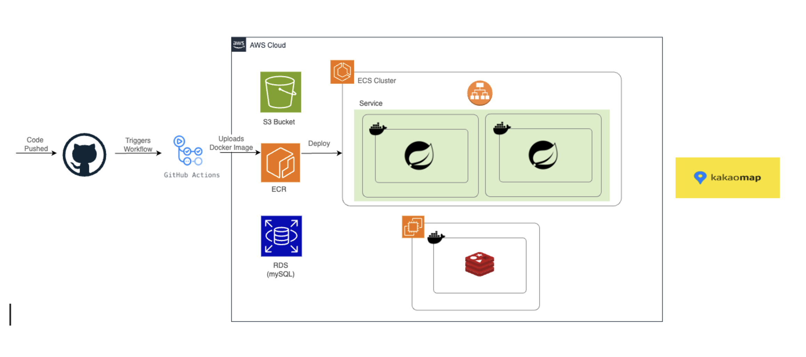
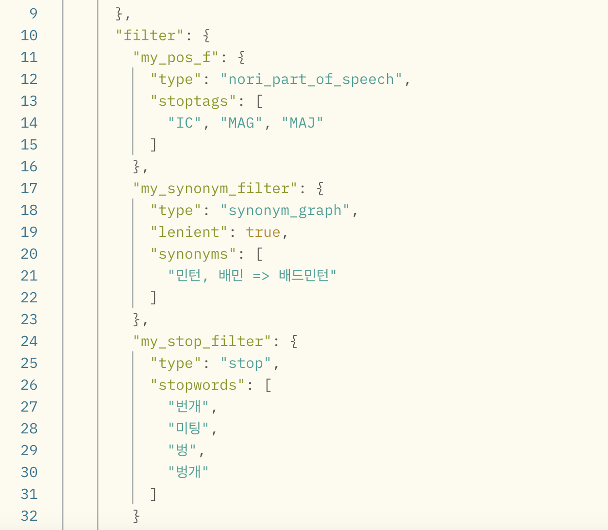
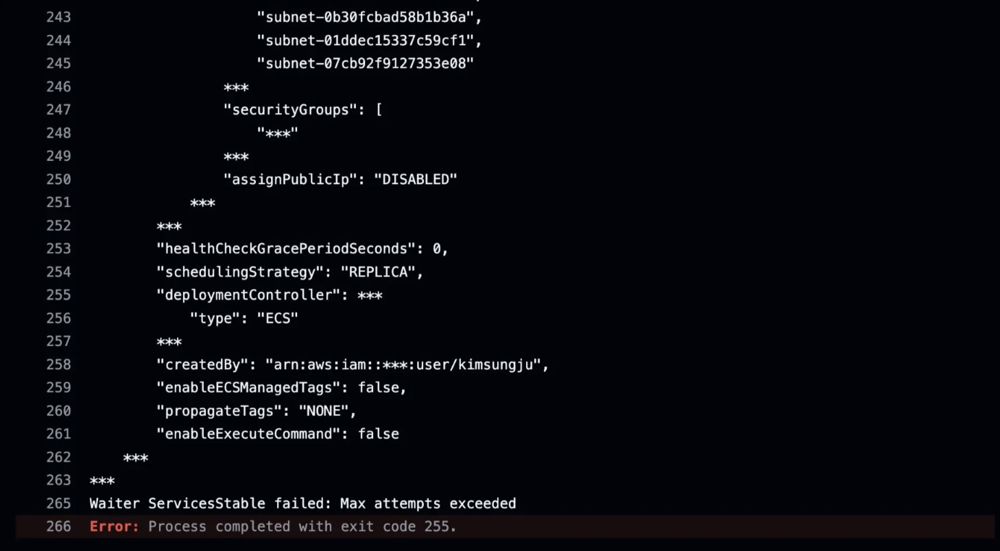
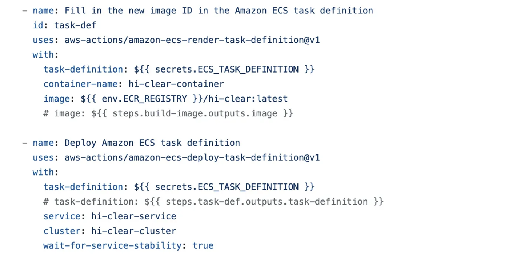
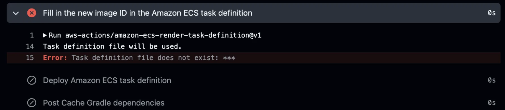
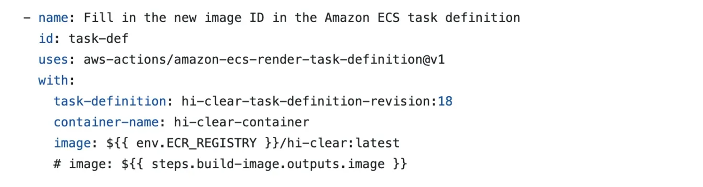

# 🏸Hi-Clear (Badminton Club & Court Reservation App)

-------------------

<br>

## 📚 Table of Contents

-----------------------
1. Introduction
2. Application Design
2. Service Architecture
3. Key Technology
4. Troubleshooting

## 📝 Introduction

-----------------------
<h3>Project Duration: 24.10.21 ~ 24.11.21 (4 weeks)</h3>
<h3>Group Name: 8-lay</h3>
<h3>Group Composition: 5 Backend Engineers</h3>
<h3>Service Overview</h3>

- Users can sign up for badminton clubs and one-time matches near their registered location 
- Users can also look up badminton gymnasiums and make reservations for private gymnasiums
- After their one-time matches, users can submit a review of the players at the match regarding their skill level and sports manners. With the accumulated reviews, the User is given an average skill score and manner score, shown in their profile.
- Business users can register their gymnasiums and recieve reservations for its badminton courts via our app

## 🖋️ Application Design

-----------------------

- [Domain Link](http://backend.8-lay-hi-clear.com/)

- [API Specification Link](https://teamsparta.notion.site/a602640d708e43e6ae316434166dd6f2?v=d3e1ab06b21a40acbd6a2c651bc639ec)

- [Wireframe Link](https://www.figma.com/design/rCMVjHvTEuh08lJ5f1kN2Q/8%EB%A0%88%EC%9D%B4-%EC%99%80%EC%9D%B4%EC%96%B4%ED%94%84%EB%A0%88%EC%9E%84?node-id=0-1&t=ySMEWBCA1OlOHPKA-1)

  

- ERD

  


## 👨🏻‍🎨 팀원 소개

-----------------------
| Avatar                                                                                  | Name          | Domain in Charge                                    | Blog Link                                        | GitHub Link                              |
|-----------------------------------------------------------------------------------------|---------------|-----------------------------------------------------|--------------------------------------------------|------------------------------------------|
|  | Sungju Kim    | Meeting, Participant                                | [Blog Link](https://velog.io/@sjkimplus09/posts) | [GitHub](https://github.com/sjkimplus)   |
|  | Taehyeok Nam  | Alarm, <br/>Club, Club Member,<br/> Comment, Thread | [Blog Link](https://navyth91.tistory.com/)             | [GitHub](https://github.com/taehyeokNam) |
|  | Yaeji Jeong   | Review, Likes,<br/>Board                            | [Blog Link](https://codingbykugom.tistory.com/)        | [GitHub](https://github.com/KUGOM)       |
|  | Jihyeon Yoon  | Schedule, Reservation                               | [Blog Link](https://velog.io/@jhy1/posts)              | [GitHub](github.com/KangDongJoon)        |
|  | DongJoon Kang | User, Gym,<br/>Court, Timeslot                      | [Blog Link](https://djhelloworld.tistory.com/)         | [GitHub](https://github.com/JH1Yoon)     |


## 🤖 Tech Stack

-----------------------
<div>
<h3>Language & Framework</h3>
      <div>
        
        
        
        
        
      </div>
<h3>Database</h3>
      <div>
        
        
        
      </div>
<h3>CI / CD</h3>
      <div>
        
        
      </div>
<h3>Cloud</h3>
      <div>
        
        
        
        
        
        
        
      </div>
<h3>Testing</h3>
      <div>
        
        
        
      </div>
</div>

## 🖼️ Service Architecture and CI/CD

-----------------------

### [Summary]
1. When code is pushed to the GitHub's `main` branch, the workflow file automatically builds the code and generates a Docker image.
2. The created Docker image is pushed to ECR with the `latest` image tag.
3. ECS (Fargate) pulls the Docker image based on the task definition specified in the workflow and deploys it.
4. Images created during user registration are managed in an S3 bucket, the main database (MySQL) is managed via RDS, and Redis used in the project is managed on a separate EC2 instance.
5. Kakao maps is an external API used to collect geographical data of an address (e.g. longitude and latitude of a location)

### [Service Architecture Considerations]
- **Amazon ECR vs. Docker Hub**
    - **Amazon ECR**
        - Pros: Integrated with AWS IAM accounts, making security management within AWS simple. Easily integrates with AWS services.
        - Cons: AWS-dependent and may be limited in environments outside AWS.
    - **Docker Hub**
        - Pros: Independent of specific cloud providers, making it flexible for multi-cloud and on-premise environments. Well-compatible with various CI/CD tools (e.g., CircleCI, TravisCI) using Docker accounts.
        - Cons: Requires separate Docker user authentication, and free plans come with limitations on private repositories and request quotas, potentially incurring additional costs.
- **ECS vs. Kubernetes**
    - **ECS**: Optimized for AWS, relatively easy to configure and manage, well-integrated with AWS services, and supports automatic scaling based on traffic.
    - **Kubernetes**: Cloud-independent, highly scalable, and provides consistent container management across various environments. However, initial setup and management can be complex.
- **Elastic Load Balancing Algorithm: Round Robin Algorithm**
    - Since server performance is similar and tasks are simple, the Round Robin algorithm is applied to distribute incoming requests.

### [CI/CD Considerations]
- **Jenkins vs. GitHub Actions**
    - **Jenkins**
        - Useful for handling sensitive data in on-premise environments.
        - Suitable for complex CI/CD workflows requiring integration with various external tools.
    - **GitHub Actions**
        - Ideal when GitHub is the primary code repository and CI/CD setup needs to be simplified.
        - Preferred for cloud-based workflows without requiring separate server maintenance.

### [Conclusion]
- Considering the small-scale of the project and that AWS and GitHub are the main platforms used, GitHub Actions is chosen for the CI/CD tool, and all tools for the service architecture are chosen from AWS.

  

## 🛎️ Key Features

-----------------------

<h3>Enhanced Location-based Gym Search Using Spatial Indexing</h3>

- **[Technology Used]** Spatial indexing based on R-tree data structure, which distinguishes data by minimum bounding rectangles in MySQL.
- **[Rationale]**
    - Calculating the distance between two geo-points with coordinate data in (type double) took too much time
    - Checking all of the location points in the database (rather than just the close ones) became very inefficient as the data size grew
- **[Metrics/Results]**
    - Response time improved from 567ms → 157ms (**260% enhancement**).
    - Under heavy load, response time improved from 10,953ms → 165ms (**6500% enhancement**).

  

<h3>Enhanced Meeting Search Using Elasticsearch</h3>

- **[Technology Used]** Elasticsearch with the Nori (Korean language analysis) plugin.
- **[Rationale]** To retrieve faster search results when users search by Meeting (one-time match) title or its address.
- **[Implementation Method]**  
  Multiple index filters were applied to maximize ElasticSearch efficiency. Interjections and adverbs were excluded, and irrelevant terms such as "match" and synonyms were registered as stopwords. Additionally, words like "minton" and "baemin" (abbreviations for "badminton" in Korean) that were not captured by the Nori tokenizer were registered as synonyms.

  
- **[Metrics/Results]**  
  The `/v1/search` API uses basic JPQL `%like%` queries, while the `/v2/search` API incorporates ElasticSearch.  
  With ElasticSearch, search query speed improved by approximately 30%.

   

<h3>Implementation of Distributed Lock (Redis) for Reviews</h3>

- **[Technology Used]** Redis-based distributed lock.
- **[Rationale]** To prevent a user for writing multiple reviews for a single user met at a match event.
- **[Metrics/Results]**  
  Duplicate review requests were prevented, reducing processing time by approximately **83%**.
    - *Before distributed lock implementation*
      
    - *After distributed lock implementation*
      
    - *RPS Comparison*
      

<h3>Optimizing User's Average Skill & Manner Score Calculation with Caching</h3>

- **[Technology Used]** Redis caching.
- **[Rationale]** To prevent unnecessary database access, significantly improve processing speed, and minimize server load.
- **[Metrics/Results]**  
  By using caching, response time for retrieval functions decreased by approximately **91%**, and database load decreased.
    - *Before caching implementation*
      
    - *After caching implementation*
      
    - *Response Time Comparison*
      

<h3>Reservation Concurrency Control</h3>

- **[Technology Used]** Redis’s `SETNX` and `EXPIRE` features.
- **[Rationale]** To prevent duplicate reservations when multiple users attempt to reserve the same court simultaneously.
- **[Metrics/Results]**  
  Using distributed locks resulted in the creation of only **one reservation** (**2653 requests, 2652 failures, 1 success**), and RPS (requests per second) improved from **149.8 → 168.9**.

  

<h3>Implementing Notification Function With SSE</h3>

- **[Technology Used]**
    - SSE: Pushes real-time, one-way events to the client.
    - Redis Pub/Sub: Acts as a message broker to efficiently relay events between clients and servers.
- **[Rationale]**
    - Redis Pub/Sub enables multiple servers to easily share messages, asynchronously process server-to-server message delivery, and allows clients to receive messages in real-time.
- **[Metrics/Results]**
    - Combining Redis with SSE improved performance by approximately **30–40%** when over 1000 clients were connected.
    - Median
      
    - 95th Percentile
      

<h3>Geocoding</h3>

- **[Technology Used]** Geocoding.
- **[Rationale]** Since users will register their interest location based on address rather than via GPS, we needed to convert string addresses to geo location points (longitude & latitude)
- **[Metrics/Results]**
    - Incorrect address input:
      
    - Correct address input:
      
      

## Troubleshooting (click the toggle to see more)

-----------------------
<details>
<summary><strong>[CI/CD] Task Fail Error</strong></summary>

__[Summary]__
- <u>Error finding Docker image</u>: Resolved by ensuring the tag name in the workflow file matches the tag name in the task definition.
- <u>Error finding task definition</u>: Resolved by using a shell command to directly download the latest task definition from AWS ECS.

__[Error Scenario 1]__ <br>
During deployment, using the workflow file, all tasks failed after starting, and subsequent retries resulted in a __‘Max attempts exceeded’__ error.


__[Root Cause 1]__ <br>
Failed to fetch the image from ECR. It was resolved by changing the image tag to ‘latest’ and modifying the task definition to look for the image with the ‘latest’ tag. Also we switched from directly invoking the task definition using a shell command to using the workflow command.

  

__[Error Scenario 2]__ <br>
After the above modifications, an error occurred indicating that the task definition file used by AWS ECS (Elastic Container Service) was not found at the specified path.

  

__[Root Cause 2]__ <br>
We assumed that it wasm because the command was missing the revision number (18) required to locate the task definition.

  

__[Error Scenario 3]__ <br>
Even with the task definition revision number specified, the task definition could not be found.


__[Root Cause 3]__ <br>
The task definition needed to be fetched directly using a shell command from AWS since it was not stored in the repository. The following command was added in the workflow file:
```angular2html
- name: Download task definition
  run: |
    aws ecs describe-task-definition --task-definition my-task-definition-family --query taskDefinition > task-definition.json
```
__[Troubleshooting Successful!]__ <br>

</details>


<details>
  <summary><strong>Index Application Process</strong></summary>

- __[Problem]__
    - Intended to enhance search functionality by applying an index using MySQL spatial functions.
    - The index was not applied when using `ST_Distance_Sphere` function.
    - 
- __[Solution]__
    - Used spatial indexes based on the R-Tree data structure.
    - Verified index application through query execution plans.
    - Filtered all data using `ST_Distance_Sphere` function before returning results.
    - Formulated a strategy to use ST_Contains for indexing.
    - 
- __[Result]__
- After applying indexing, response speed improved __by at least 260%__ under normal load and __up to 6500%__ under high load, during Locust testing.

  

</details>


<details>
  <summary><strong>Applying Distributed Lock for Reviews</strong></summary>

- __[Problem]__
    - Attempted to apply a distributed lock to prevent users submitting duplicate reviews.
    - Despite applying the lock, testing showed that 2–3 duplicate requests were occasionally bypassing the lock.
- __[Solution]__
    - Found that the process of acquiring and releasing the lock was too fast, allowing some requests to bypass the lock.
    - Introduced a delay using `Thread.sleep(100);` to slow down the lock acquire-release process.

    - 
- __[Result]__
    - After introducing some delay in the lock's acquire-release process, no requests were able to bypass the lock.


</details>
<br>

## ✏️ Reflections

------

### Dongjoon Kang
- It was great to learn and apply database indexing in-depth. I experimented with Elasticsearch but only at a basic level, which was disappointing. Next time, I aim to enhance Elasticsearch usage to improve the completeness of search functionality.

### Sungju Kim
- I hope that next time we could adopt an MSA structure for our service architecture. Considering the app offers diverse services, it would have been better to have servers segmented by functions like club management, meeting management, user reservation management etc.

### Taehyeok Nam
- While implementing notification services, I realized I didn’t fully understand the flow and structure of my service despite studying SSE, message queues, and Redis Pub/Sub. I hesitated with troubleshooting and refactoring, delaying the coding start.
- The implementation took much longer than planned. Next time, I aim to organize my understanding of the service's flow and structure more effectively, start coding earlier without fear of trial and error, and challenge myself to apply RabbitMQ and Kafka, which I couldn't try this time.

### Yaeji Jeong
- When applying distributed locks using Redis, I chose Lettuce, which is lightweight and high-performing given the project's nature. However, if given a chance, I’d like to explore using Redisson.

### Jihyeon Yoon
- To control concurrency, I applied a distributed lock. I’d like to enhance performance by caching frequently queried data in memory during database retrieval to reduce repetitive DB queries.