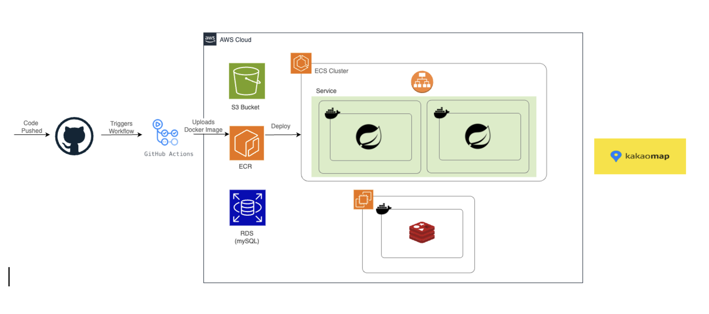
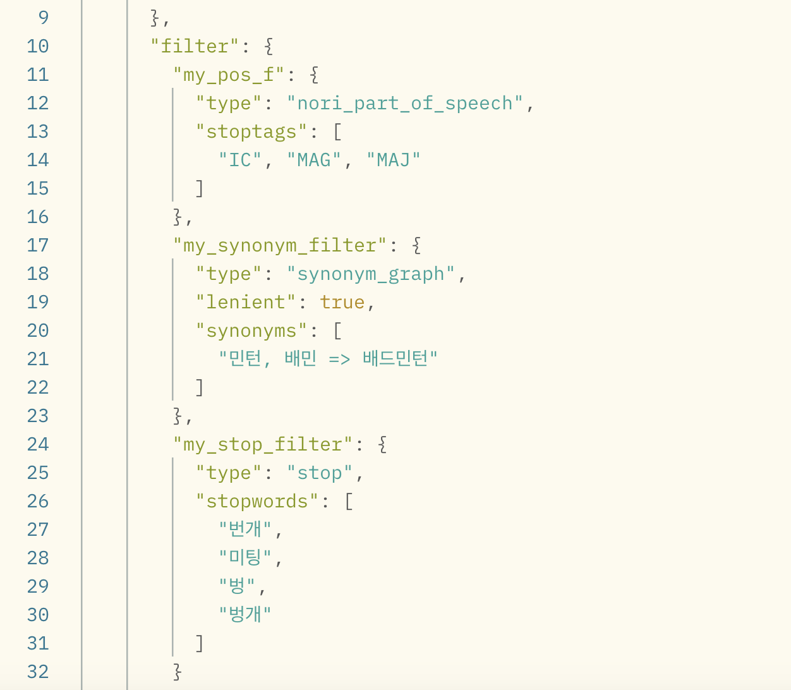
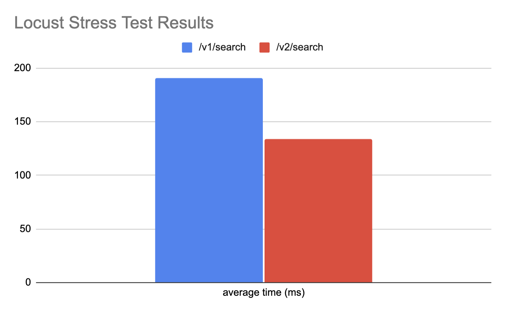
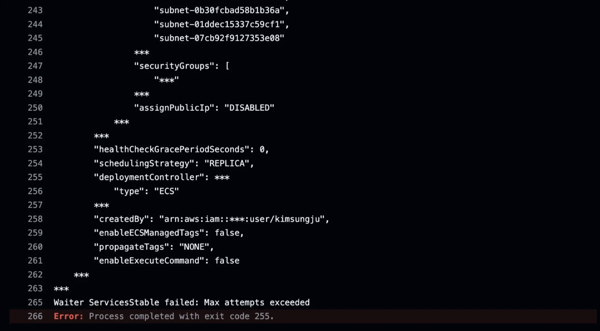
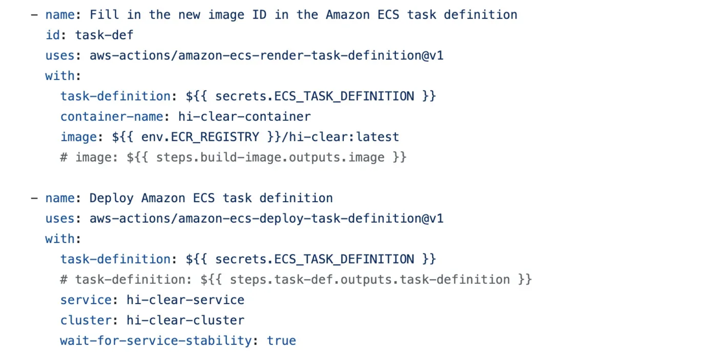
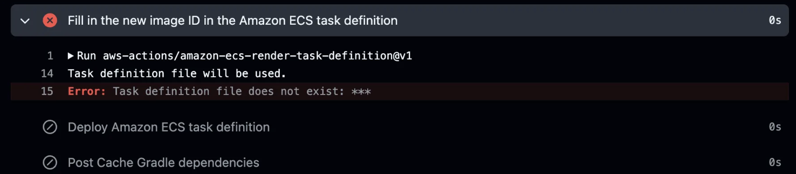
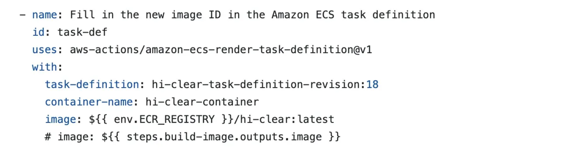
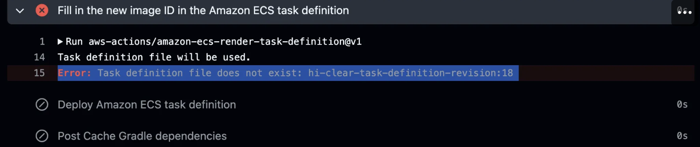
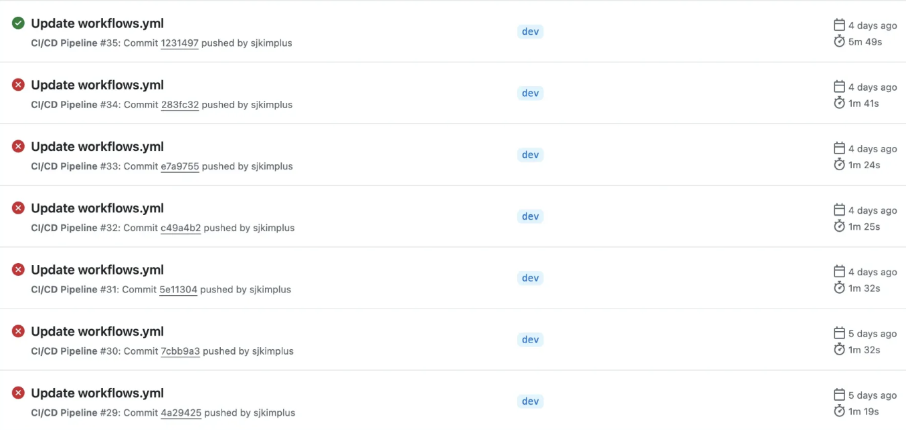

# 🏸Hi-Clear (배드민턴 모임 및 코트 예약 서비스)

-------------------

<br>

## 목차

-----------------------
1. 프로젝트 기획 및 목적
2. 서비스 아카텍처
3. 핵심기능
4. 트러블슈팅
5. 적용기술
   <br><br>

## 프로젝트 기획 및 목적

-----------------------
- 배드민턴 동호인들이 __정기적 모임__과 __일회성 모임__으로 배드민턴을 칠 수 있도록 관리해주는 서비스
- __위치기반 체육관, 번개, 클럽 조회기능__ 제공
- 유저들간 평가를 통해 __실력 및 매너점수 평가__ 기능 제공
  <br><br>

## 서비스 아키텍쳐 및 CI/CD

-----------------------

비교적 소규모 프로젝트인 것과 AWS와 Github을 메인으로 프로젝트를 구축하는 것을 고려하여 CI/CD로는 Github Actions, 서비스 아키텍처 관련 튤은 모두 AWS에서 선택하였다. 깃허브 main브랜치에 코드를 올리면 workflow 파일을 통해 자동으로 build가 되고, 도커 이미지를 ECR에 올린다. 이후, ECS(fargate)에서 이 도커이미지를 이용하여 배포를 한다. 이외에 유저 회원가입에서 생성되는 이미지는 S3 버켓에서 관리하고, 메인 데이터 베이스 관리는 RDS 에서, 그리고 분산락과 캐싱에서 사용하는 redis는 별도의 EC2에서 관리된다. 
### [Service Architecture 고려사항]
- __Amazon ECR vs Docker Hub__
    - __Amazon ECR__
        - 장점: AWS IAM과 통합되어 AWS 내 보안 관리가 간편하며, 리포지토리 정책을 통해 이미지 접근을 제어할 수 있음. AWS 서비스와의 연동이 쉬움.
        - 단점: AWS에 종속적이며, AWS 외 다른 환경에서의 사용이 제한적일 수 있음.
    - __Docker Hub__
        - 장점: 특정 클라우드 제공자에 종속되지 않고, 멀티 클라우드 및 온프레미스 환경에서 유연하게 사용 가능. Docker 계정으로 다양한 CI/CD 도구와 잘 호환됨 (예: CircleCI, TravisCI).
        - 단점: 별도의 Docker 유저 인증이 필요하며, 무료 플랜은 제한된 private저장소 및 요청 제한이 있어 비용이 추가될 수 있음.
- __ECS__ __vs.__ __Kubernetes__
    - __ECS__: AWS에 최적화되어 설정과 관리가 비교적 쉬움. AWS 내 서비스와 통합이 좋고 트래픽양에 따른 자동 확장 지원.
    - __Kubernetes__: 클라우드(AWS)와 독립적이고 확장성이 좋고, 다양한 환경에서 일관된 컨테이너 관리를 제공. 초기 설정과 관리가 복잡할 수 있음.
- __Elastic Load Balancing Algorithm: Round Robin 알고리즘__
    - 서버간의 성능이 유사하고 처리하는 작업들이 간단하므로 __순서대로 돌아가며 작업__을 나누어주는 라운드로빈 알고리즘 적용.
### [CI/CD 고려사항]
- __Jenkins vs GitHub Actions__
  - __Jenkins__
      - 온프레미스 환경에서 민감한 데이터를 처리해야 하는 경우 사용에 용이.
      - 복잡한 CI/CD 워크플로와 다양한 외부 도구 통합이 필요한 경우에 용이.
  - __GitHub Actions__
      - GitHub를 주요 코드 저장소로 사용하며, CI/CD 설정을 간단히 하고 싶은 경우에 용이.
      - 클라우드 기반 워크플로를 선호하며, 별도의 서버 유지보수를 할 필요가 없다.
<br>



## 핵심 기능

-----------------------
<h3>SSE 알림 기능</h3>

- __[사용기술]__
- SSE : 클라이언트에게 실시간 및 단방향으로 이벤트를 푸시
- Redis Pub/Sub : 메시지 브로커 역할을 하여 클라이언트와 서버 간의 이벤트를 효율적으로 전달
- __[도입이유]__ Redis Pub/Sub을 통해 여러 서버가 메시지를 쉽게 공유가 가능하고 서버 간의 메시지 전달을 비동기적으로 처리하며 
클라이언트가 실시간으로 메시지를 전달받을 수 있습니다.
- __[수치/결과]__

테스트환경 : Local, Locust

테스트 조건 :
  
최대 유저 1000명

초당 늘어나는 유저 수 100명

테스트 시간 60초


  

중위값

  

상위 95%

  

SSE
  

Redis
  
  
SSE만 사용했을 때보다 Redis를 함께 사용했을 때 1000명 이상의 클라이언트가 접속 시 약 30~40% 성능 향상이 있었습니다.
<h3>유저 리뷰 생성 분산락</h3>

- __[사용기술]__ Redis를 사용한 분산락
- __[도입이유]__ 분산락을 사용하여 프로그램이 경쟁 상태에 들어가는것을 방지하고 데이터의 정합성을 유지, 서버 부하를 관리 하기 위해
- __[수치/결과]__ 중복 요청이 방지되어 처리시간, 리뷰 중복 생성이 감소하였습니다.
- <u>분산락 도입 전</u>
  
- <u>분산락 도입 후</u>
  
- <u>RPS 비교</u>

  

<h3>캐싱을 적용한 유저 리뷰 서비스</h3>

- __[사용기술]__ Redis 캐싱
- __[도입이유]__ Redis의 캐싱을 사용하여 불필요한 DB 접근을 방지하여 처리 속도를 크게 향상하고 서버의 부화를 최소화 하기 위해
- __[수치/결과]__ 캐시를 사용함으로써 조회 기능의 응답 시간이 크게 상승, DB에 걸리는 부하가 감소하였습니다.
- <u>캐싱 도입 전</u>
  
- <u>캐싱 도입 후</u>
  
- <u>그래프 비교</u>
  


<h3>예약 동시성 제어</h3>

- __[사용기술]__  Redis의 Lock 기능
- __[도입이유]__ 분산락을 구현하여 동시에 여러 명의 사람들이 예약하려고 할 때 중복 예약 생엉을 제외하기 위해서
- __[수치/결과]__ 분산락을 이용했을 때 예약 1개만 생성되고(중복 예약 제외), 락을 걸기 전보다 RPS(초당 처리할 수 있는 요청 수)가 높다.
  


<h3>공간 인덱스를 활용한 검색 기능 향상</h3>

- __[사용기술]__ MySQL의 공간인덱스 및 공간함수
- __[도입이유]__ 
- double값으로 좌표를 받고 계산하게되면 모든 데이터에대해 복잡한 수식을 계산
- 거리계산의 경우 인덱스 미적용 성능저하 발생
- __[수치/결과]__
- 

<h3>Elastic Search를 활용한 번개 및 모임 검색</h3>

- __[사용기술]__ Elastic Search 와 nori 형태소 분석 플러그인
- __[도입이유]__ 번개 제목 및 주소로 유저가 검색시 더 빠른 결과 값을 가져오기 위해
- __[도입방식]__ <br>
  elastic search의 효율을 극대화 하기 위해 index 필터를 여러게 적용시켰다. 감탄사와 부사를 제외 시키고, 
  번개들 제목에서 의미가 없는 ‘번개’ 및 유사어들을 stopwords로 등록 시켰다. 또한 nori_tokenizer가 단어로 
  캐치하지 못한 ‘민턴’ 과 ‘배민’이라는 단어들을  (‘배드민턴’의 줄인 말)  synonym으로 등록해 주었다.

  
- __[수치/결과]__ <br>
'/v1/search' API가 기본 JPQL %like% 쿼리를 사용한 검색이고
'/v2/search' API가 Elastic Search를 도입한 쿼리이다.<br>
 Elastic Search의 도입으로 검색 쿼리의 속도가 약 30% 향상되었다.



<h3>지오코딩</h3>

- __[사용기술]__ 지오코딩
- __[도입이유]__ 사용자가 특정 좌표값을 알고 입력하기 어려움(주소 입력)
- __[수치/결과]__
- 

## 트러블슈팅(트러블 제목 클릭)

-----------------------
<details>
<summary><h3>[CI/CD] Task Fail Error</h3></summary>

__[에러 상황 1]__ <br>
workflow 파일로 deploy 과정 중 테스크가 시작후, 모두 fail, 향후 재시도후 __‘Max attempts exceeded’__ 에러 발생
  

__[원인 분석 1]__ <br>
ECR에 있는 이미지를 가져오는데 실패를 한것이라 생각하여, image tag를 ‘latest’로 수정 및 task definition에서도 ‘latest’라는 image tag로 이미지를 찾도록 수정
또한, 더 이상 task definition을 직접적인 shell command로 부르지 않고 다시 workflow command를 사용하는 방식으로 수정

  

__[에러 상황 2]__ <br>
수정후, AWS ECS (Elastic Container Service)에서 사용하는 task definition 파일이 지정된 경로에 없다는 에러가 발생

  

__[원인 분석 2]__ <br>
task definition을 찾을 수 있도록 revision번호(18)를 command에 포함

  

__[에러 상황 3]__ <br>
revision 번호가 표기된 task definition도 못찾는 에러발생


__[원인 분석 3]__ <br>
  task definition을 찾을 수 있도록 revision번호(18)를 command에 포함
  공식 홈페이지를 찾아보니 task definition을 리포지토리에 저장하지 않을 경우 AWS에서 다운해가는 shell command 를 쓰면된다고 하여서, 다음과 같이 수정.
```angular2html
- name: Download task definition
  run: |
    aws ecs describe-task-definition --task-definition my-task-definition-family --query taskDefinition > task-definition.json
```
__[Trouble shooting 성공!]__ <br>

</details>


<details>
  <summary><h3>인덱스 적용과정</h3></summary>

- __[문제]__
  - MySQL 공간함수를 사용하여 인덱스를 적용시켜 검색기능을 향샹시키고자함
  - ST_Distance_Sphere를 사용했을 때 인덱스가 적용되지 않음
  - 
- __[과정]__
  - 쿼리 실행계획을 사용하여 인덱스 적용 확인
  - ST_Distance_Sphere를 사용하여 모든 데이터를 필터링 한 후 결과 반환
  - ST_Contains를 사용하여 인덱싱하는 전략 구성
  - 
- __[결과]__
- 인덱싱 적용 후 응답속도 최소 3.6배 상승, 부하량 증가 시 성능차이 극대화
- 
</details>


## 적용 기술

-----------------------
<h3>언어 및 프레임워크</h3>
<table border="0">
  <tr>
    <td align="center">
      <a href="https://skillicons.dev">
        
      </a>
      <div>Java</div>
    </td>
    <td align="center">
      <a href="https://skillicons.dev">
        
      </a>
      <div>Spring</div>
    </td>
  </tr>
</table>

<h3>데이터베이스</h3>
<table border="0">
  <tr>
    <td align="center">
      <a href="https://skillicons.dev">
        
      </a>
      <div style="text-align: center;">MySQL</div>
    </td>
   <td align="center">
      <a href="https://skillicons.dev">
        
      </a>
      <div style="text-align: center;">Redis</div>
    </td>
    <td align="center">
      <a href="https://skillicons.dev">
        
      </a>
      <div style="text-align: center;">Elasticsearch</div>
    </td>
  </tr>
</table>

<h3>CI/CD 및 형상기억</h3>
<table border="0">
  <tr>
    <td align="center">
      <a href="https://skillicons.dev">
        
      </a>
      <div>Docker</div>
    </td>
    <td align="center">
      <a href="https://skillicons.dev">
        
      </a>
      <div>Github Actions</div>
    </td>
    <td align="center">
      <a href="https://skillicons.dev">
        
      </a>
      <div>Git</div>
    </td>
    <td align="center">
      <a href="https://skillicons.dev">
        
      </a>
      <div>GitHub</div>
    </td>
  </tr>
</table>

<h3>클라우드</h3>
<table border="0">
  <tr>
    <td align="center">
      <a href="https://skillicons.dev">
        
      </a>
      <div>AWS</div>
    </td>
    <td colspan="2" style="text-align: center;">
      <div>
        
        
        
        
      </div>
    </td>
  </tr>
</table>
<h3>기타</h3>
      <div>
        
        
        
        
      </div>
      <div>
        
        
        
      </div>
<br>